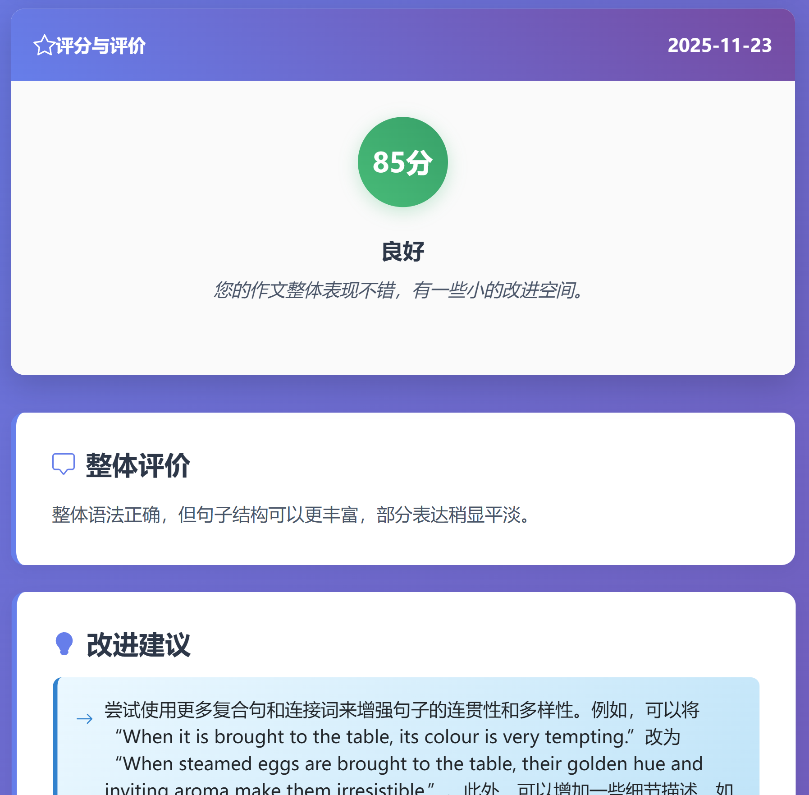

# 英语写作助手（English Writing Helper）

## 项目介绍

英语写作助手是一个基于Flask框架开发的Web应用，旨在帮助学生提升英语写作能力。该应用通过智能生成作文题目、自动评审作文内容并提供详细改进建议，为英语学习者提供便捷的写作练习和反馈工具。

## 效果展示

### **智能题目生成**：根据不同年级水平自动生成适合的英语作文题目
---

---


### **作文自动评审**：对提交的作文进行评分和整体评价


### **历史记录管理**：保存并展示用户的写作历史，方便查看学习进度和历史评价


## 技术架构

- Python 3.6 或更高版本
- Flask 框架
- AI 平台: 讯飞星辰 Agent 开源平台 （[https://github.com/iflytek/astron-agent](https://github.com/iflytek/astron-agent)）


## 配置方法


### 1. 工作流配置

将workflow目录下的english_writting_helper.yml文件导入到讯飞星辰Agent开源平台。

创建知识库（名称为`英语写作助手`），检查工作流是否引用正确

向知识库添加文档，文档的格式为
```
七年级范文
xxxxx作文内容xxxx
--------

七年级范文
xxxxx作文内容xxxx
--------

八年级范文
xxxxx作文内容xxxx
--------
```
建议：先在讯飞星辰Agent平台对工作流进行调试，确保工作流运行正确。


### 2. 依赖安装

首先，确保您已安装Python。然后，安装所需的Python包：

```bash
pip install flask json5
```

### 3. API配置

通过讯飞星辰Agent平台发布工作流的时候，可以获取下列参数，在`config.py`文件中进行配置：

```python
# 讯飞星火API配置
API_KEY = "your_api_key_here"
API_SECRET = "your_api_secret_here"
API_FLOW_ID = "your_flow_id_here"
XUN_FEI_URL = "your_xun_fei_url_here"
```


## 启动和访问方法

### 1. 启动应用

完成所有配置后，导航到根目录，执行：

```bash
python app.py
```

### 2. 访问应用

应用启动成功后，打开Web浏览器，输入地址 `http://127.0.0.1:5000/` 

## 未来改进方向

### 1.个性化学习路径
系统可以根据学生的历史作文表现，智能推荐更适合其当前水平的题目。

### 2.范文对比
在给出评价后，可以同时提供一篇同主题的优秀范文，让学生进行对比学习。

### 3.错题本功能
自动将常见的语法错误、用词不当等问题归纳总结，形成个人的“写作弱点分析报告”。

感谢使用英语写作助手！如有任何问题或建议，欢迎反馈。
